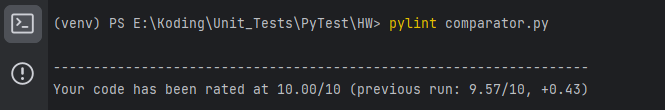
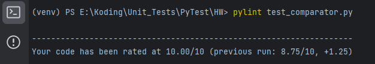
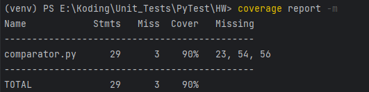

# Урок 6. Юнит тестирование в других языках
## Задание 
Создайте программу на Python или Java, которая принимает два списка чисел и выполняет 
следующие действия:
1) Рассчитывает среднее значение каждого списка. 
2) Сравнивает эти средние значения и выводит соответствующее сообщение:
- ""Первый список имеет большее среднее значение"", если среднее значение первого списка больше.
- ""Второй список имеет большее среднее значение"", если среднее значение второго списка больше.
- ""Средние значения равны"", если средние значения списков равны.

## Код программы
[comporator](https://github.com/Anna1606/PyTest/tree/master/HW)
## Код тестов
[test_comporator](https://github.com/Anna1606/PyTest/tree/master/HW)
## Отчет pylint

## Отчет о покрытии тестами

